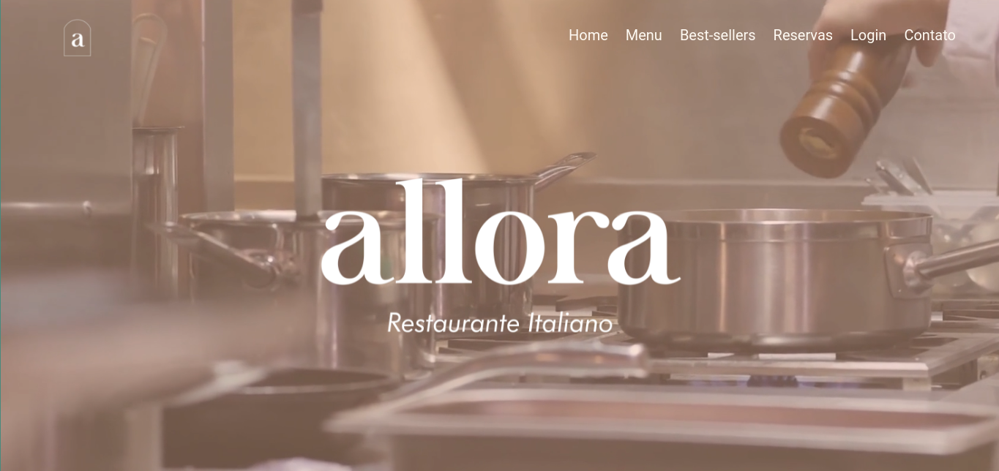
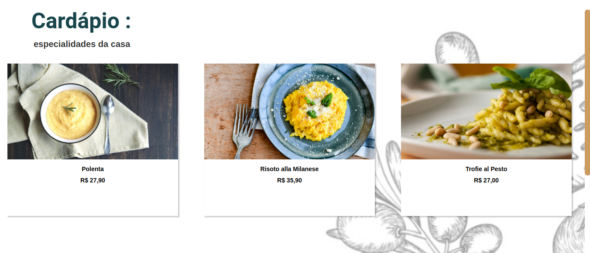
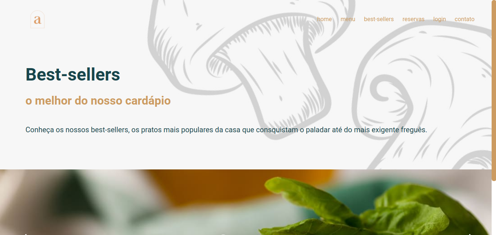
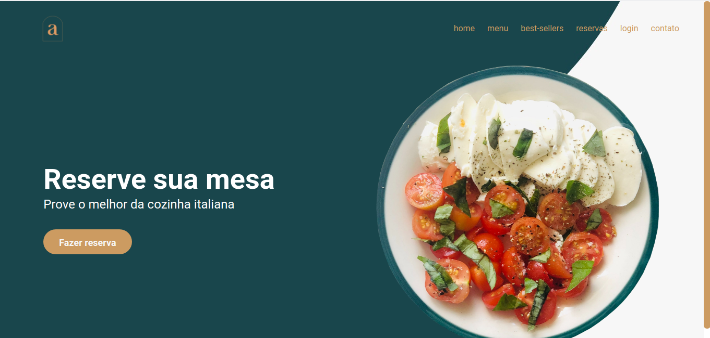
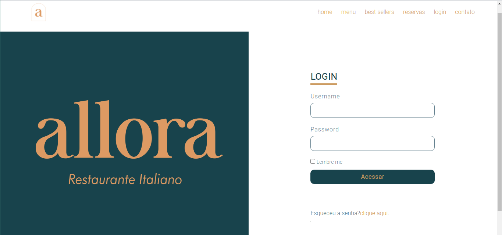
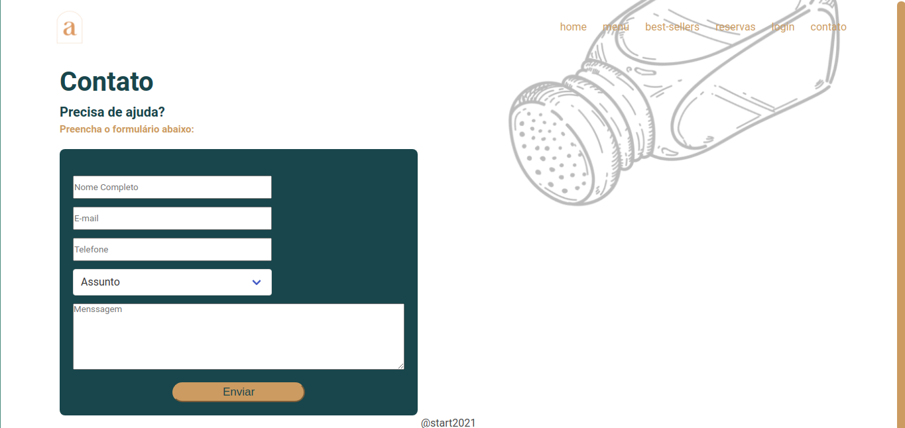

  

# Projeto do Start

Projeto em grupo feito para a avaliação dos conhecimentos em HTML, CSS e Javascript.

## Features

- [Tela Home](#home)
- [Tela de Cardápio](#menu)
- [Pratos Populares](#best-sellers)
- [Reservas](#reservas)
- [Login](#login)
- [Contato](#contato)
  
## Tecnologias utilizadas

**Front-end:** HTML, CSS, Javascript, [Bulma](https://bulma.io/documentation/) e [SwiperJS](https://swiperjs.com/)
  
## Projeto

Você pode conferir o design inicial do projeto no
[Figma.](https://www.figma.com/file/25wftXnAS0lizVhBBRh7Q1/Restaurante-Copy)

<h2 id="home">Tela Home</h2>

<h2 id="menu">Tela de Cardápio</h2>

<h2 id="best-sellers">Tela de Pratos populares</h2>

<h2 id="reservas">Tela de Reservas</h2>

<h2 id="login">Tela de Login</h2>

<h2 id="contato">Tela de Contato</h2>

## Quem colaborou com o projeto

- [@bruna-fonseca](https://github.com/bruna-fonseca)
- [@beatrizrnogueira](https://github.com/beatrizrnogueira)
- [@OtavioFalcaof](https://github.com/OtavioFalcaof)
- [@Aieychan01](https://github.com/Aieychan01)
- [@GustavoSilva-hub](https://github.com/GustavoSilva-hub)
- [@Cristyandarlen](https://github.com/Cristyandarlen)

  
